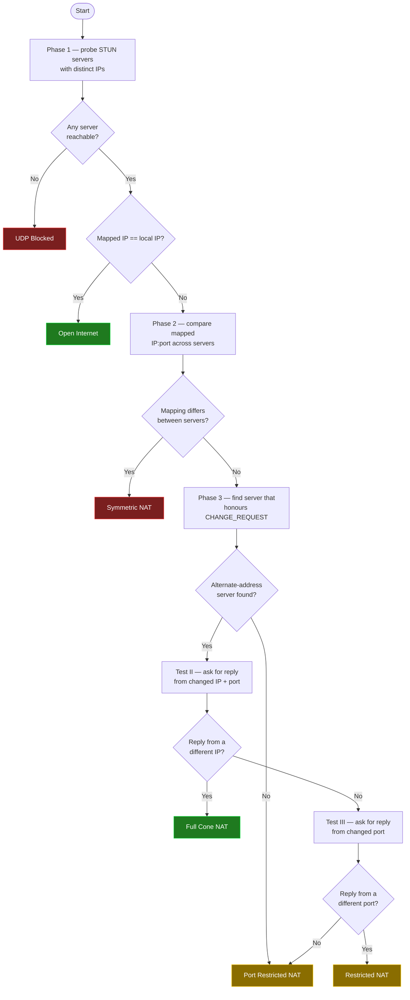

# C++ NAT Checker

> RFC-compliant NAT Type Detection for Linux — implementing RFC 3489, RFC 5389, and RFC 5780.

---

## Overview

A lightweight C++ tool that determines your NAT type by speaking STUN across three RFC generations. It handles classic STUN, modern STUN with Magic Cookie, and full NAT behavior discovery — all from a single binary.

---

## Install

Grab a prebuilt, statically-linked Linux binary from the
[Releases](../../releases) page — it runs on any x86_64 distro with no
dependencies:

```bash
curl -L -o nat_check https://github.com/jayng9663/NAT-Checker/releases/latest/download/nat_check-linux-x86_64
chmod +x nat_check
./nat_check
```

## Build from source

Requires a C++17 compiler and CMake ≥ 3.16.

```bash
cmake -S . -B build -DCMAKE_BUILD_TYPE=Release
cmake --build build -j
./build/nat_check
```

Optionally install system-wide (`/usr/local/bin` by default):

```bash
sudo cmake --install build
```

To reproduce the fully-static release binary (musl/Alpine):

```bash
cmake -S . -B build -DCMAKE_BUILD_TYPE=Release -DNATCHECK_STATIC=ON
```

## Usage

```bash
nat_check                 # detect NAT type using the default server pool
nat_check -v              # verbose, per-test detail
nat_check --server stun.stunprotocol.org --port 3478
nat_check --version
```

---

## Project layout

```
src/
  main.cpp          CLI argument parsing + entry point
  output.{hpp,cpp}  banner / result / usage rendering
  nat_detector.*    RFC 3489 / 5780 detection algorithm (3-phase)
  udp_socket.*      RAII UDP socket + hostname resolution
  stun.*            STUN message builder, parser, types, constants
  crc32.*           IEEE 802.3 CRC32 (RFC 5389 FINGERPRINT)
  colors.hpp        ANSI color macros
CMakeLists.txt      build configuration
.github/workflows/  CI (build + smoke test) and tagged-release pipelines
```

## Releasing

Pushing a version tag triggers the [release workflow](.github/workflows/release.yml),
which builds the static binary and publishes a GitHub Release:

```bash
git tag v1.0.0
git push origin v1.0.0
```

---

## Protocol Support

| RFC | Name | Key Features |
|-----|------|--------------|
| [RFC 3489](https://datatracker.ietf.org/doc/html/rfc3489) | Classic STUN | `CHANGE_REQUEST`, `CHANGED_ADDRESS`, `SOURCE_ADDRESS` |
| [RFC 5389](https://datatracker.ietf.org/doc/html/rfc5389) | Modern STUN | Mandatory Magic Cookie, `XOR-MAPPED-ADDRESS`, `FINGERPRINT` (CRC32) |
| [RFC 5780](https://datatracker.ietf.org/doc/html/rfc5780) | NAT Behavior Discovery | Built on RFC 5389 — adds `OTHER-ADDRESS`, `RESPONSE-ORIGIN` |

---

## Detected NAT Types

| NAT Type | Description |
|----------|-------------|
| **Open Internet** | No NAT present |
| **Full Cone NAT** | All external hosts can reach the mapped port |
| **Restricted NAT** | Only hosts the client has sent to can reply |
| **Port Restricted NAT** | Host *and* port must match a prior outbound packet |
| **Symmetric NAT** | Each destination gets a unique mapped port |
| **UDP Blocked** | UDP traffic is not passing through |

---

## How it works

The detector runs a three-phase STUN probe and narrows the NAT type at each step:



---

## Attribution

Portions of this codebase were generated with the assistance of [Claude](https://claude.ai) (Anthropic's AI assistant).
